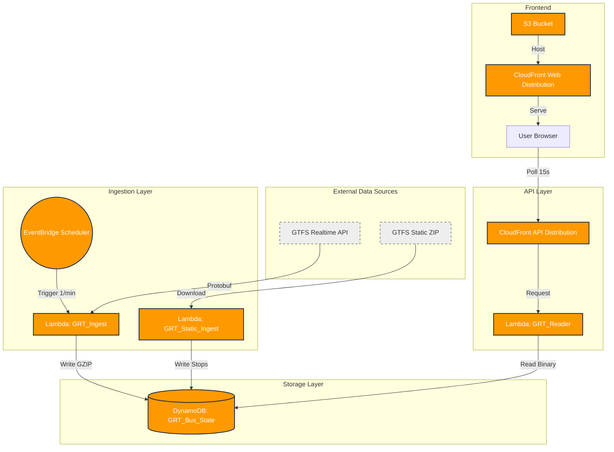

# Grand River Current

**Grand River Current** is a high-performance, real-time bus tracking application for the Grand River Transit (GRT) system in the Region of Waterloo. It is designed to be lightweight, serverless, and extremely cost-effective, leveraging AWS Free Tier eligible services.

## 🚀 Features

- **Real-Time Tracking**: Visualizes bus locations with bearing/direction updates every 30 seconds.
- **Stop Lookups**: Search by stop ID to see stop location and details.
- **Optimized Data**: Uses binary GZIP compression for bus data in DynamoDB to minimize read/write costs.
- **Serverless Architecture**: Fully event-driven using AWS Lambda, DynamoDB, and CloudFront.
- **Static & Realtime Data**: Ingests both GTFS Static (schedules/stops) and GTFS Realtime (vehicle positions).

## 🏗 Architecture

The system is built on a "Serverless Microservices" pattern:



### 1. Ingestion Layer (`src/lambda/pkg_ingest`, `pkg_static`)
- **GRT_Ingest**: Triggers every minute (via EventBridge Scheduler). Fetches GTFS-Realtime Protobuf data from the GRT Open Data API, parses it, compresses the vehicle list into a GZIP binary blob, and saves it to DynamoDB.
- **GRT_Static_Ingest**: Runs on-demand or weekly. Downloads the huge GTFS Static ZIP, extracts `stops.txt`, and populates the DynamoDB table with stop coordinates and names.

### 2. Storage Layer (DynamoDB)
- **Table**: `GRT_Bus_State`
- **Data Model**:
  - `PK: BUS_ALL` -> Contains the latest compressed binary list of all active buses.
  - `PK: STOP#<stop_id>` -> Contains static details for a specific stop.

### 3. API Layer (`src/lambda/pkg_reader`)
- **GRT_Reader**: A read-only Lambda that serves as the backend API.
  - `GET /` -> Returns all bus positions (decompresses binary data from DB).
  - `GET /?stop_id=1234` -> Returns stop details.
  - `GET /?vehicle_id=999` -> Returns specific bus details.
- **CloudFront**: Acts as the "Shield" and CDN, caching API responses to reduce Lambda invocations and DynamoDB reads.

### 4. Frontend (`src/frontend`)
- A vanilla HTML/CSS/JS application using **Leaflet.js** for mapping.
- Hosted on S3 behind CloudFront for SSL and low latency.
- Polls the API every 15 seconds for bus updates.

## 📂 Project Structure

```
grand_river_current/
├── src/
│   ├── lambda/          # Python source code for Lambda functions
│   │   ├── pkg_ingest/  # Real-time data fetcher
│   │   ├── pkg_reader/  # API handler
│   │   ├── pkg_static/  # Static GTFS importer
│   │   └── ...
│   └── frontend/        # Web assets (index.html, css, js)
├── scripts/             # Deployment and maintenance scripts
├── infra/               # IAM policies and infrastructure config
├── tools/               # Utility scripts for debugging and data patching
└── requirements.txt     # Python dependencies
```

## 🚀 Deployment (AWS SAM)

This project is built using the AWS Serverless Application Model (SAM).

### Prerequisites
- [AWS CLI](https://aws.amazon.com/cli/) configured with `aws configure`
- [AWS SAM CLI](https://docs.aws.amazon.com/serverless-application-model/latest/developerguide/install-sam-cli.html) installed
- [Python 3.10](https://www.python.org/downloads/) installed
- [Docker](https://www.docker.com/) (Recommended for building with `--use-container`)

### 1. Build & Deploy
Run the following commands in the project root:

```bash
# Build the application
sam build --use-container

# Deploy to AWS (Guided for the first time)
sam deploy --guided
```

During the guided deployment, accept the defaults or provide custom values:
- **Stack Name**: `grand-river-current`
- **AWS Region**: `us-east-1` (or your preferred region)
- **Parameter DYNAMO_TABLE**: `GRT_Bus_State`
- **Confirm changes before deploy**: `y`
- **Allow SAM CLI IAM role creation**: `y`
- **Disable rollback**: `n` (keep enabled for safety)
- **GRT_Reader Function URL may not have authorization defined**: `y` (Public API)

### 2. Post-Deployment Configuration
After a successful deployment, SAM will output the `ApiUrl` and `FrontendUrl`.

1. **Update Frontend Config**:
   - Open `src/frontend/js/app.js`
   - Update `const API_URL` with your new `ApiUrl` value.

2. **Deploy Frontend to S3**:
   ```bash
   # Get your bucket name from SAM outputs or S3 console
   aws s3 sync src/frontend s3://<your-frontend-bucket-name> --delete
   ```

3. **Visit your Site**:
   - Open the `FrontendUrl` (CloudFront URL) in your browser.

## 🔗 APIs & Data Sources

- **GTFS Realtime**: `https://webapps.regionofwaterloo.ca/api/grt-routes/api/VehiclePositions`
- **GTFS Static**: `https://webapps.regionofwaterloo.ca/api/grt-routes/api/gtfs.zip`

## 📜 License
This project is for educational and portfolio purposes. Data is provided by the Region of Waterloo Open Data.
